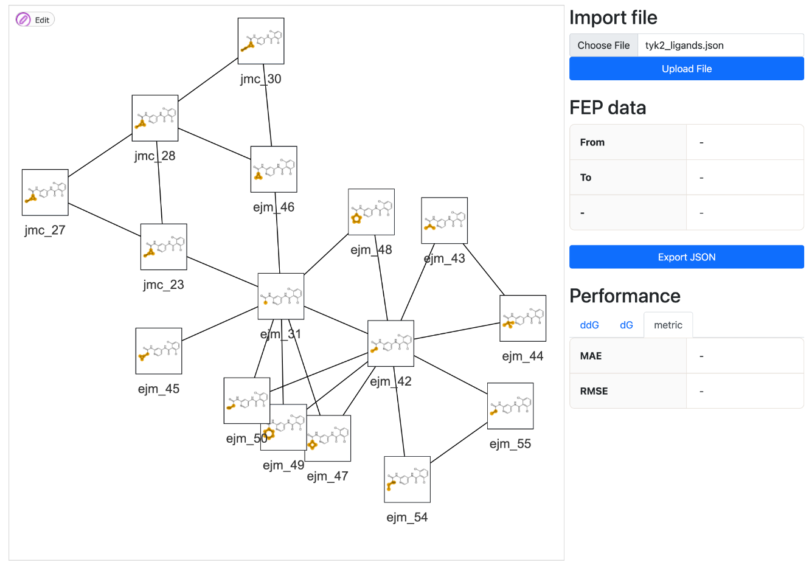
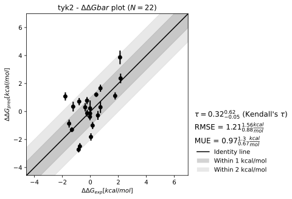

# QligFEP  

This folder contains a step by step tutorial to setup and
analyze QligFEP calculations, as reported in Jespers et al.
(https://doi.org/10.1186/s13321-019-0348-5).  

The workflow consists of the following steps:  

1. Generate ligand parameters from `.sdf` files using OpenFF;
    - Comprised of: `prm`, `lib`, `pdb`, and `.sdf` files for each one of the ligands.
2. Setup your perturbation network using the Lead Optimization Mapper (LOMAP) software;
3. Create the water sphere required for running the simulation with the spherical boundary condition;
4. Setup all FEP calculations through the command line using the files generated through steps 1); 2); and 3);
5. Submit the jobs to an HPC cluster;
6. Analyze the results.

# Tutorial

## Prerequisites

Before starting this tutorial, ensure that:

**Q6 is compiled**: Navigate to `src/q6` directory and run `make all && make mpi` to compile the Q6 binaries before proceeding.

We start this tutorial preparing the ligands for the simulations. Navigate to the directory with the ligand files:
```bash
cd tutorials/Tyk2/ligprep
```

## Ligand parameters

We then need to generate the ligand parameter, library, and pdb files. For this we use NAGL for a faster calculation of the partial charges. This is still experimental, so for your own experiments, please use the default method ([AM1-BCC](https://pubmed.ncbi.nlm.nih.gov/12395429/)) simply by not adding the `-nagl` flag.
```bash
qparams -i tyk2_ligands.sdf -p 4 -nagl
```
Create your perturbation network using lomap:
```bash
qlomap -i tyk2_ligands.sdf
```
Now, let's create a directory for your perturbations and copy the files we generated to it:
```bash
cd ../
# Copy the files ligand files:
cp ligprep/*.pdb ligprep/*.prm ligprep/*.lib setupFEP/
# Copy the separate .sdf files and the lomap.json file:
cp ligprep/tyk2_ligands/*.sdf ligprep/tyk2_ligands/lomap.json setupFEP/
```

## Visualize the perturbation network

Visualizing and interacting with the generated perturbation network from `qlomap` is possible by using the `qmapfep` program. For this, _make sure you're working locally (not on a remote machine)_.

Now that the `lomap.json` was created under `tyk2_ligands/lomap.json`, let's use both the input `.sdf` file and the generated mapping `.json` file to crate the visualizer. From the main Tyk2 directory, run:

```bash
cd ../  # Go back to tutorials/Tyk2 directory
qmapfep -i ligprep/tyk2_ligands.sdf -wd . -l ligprep/tyk2_ligands/lomap.json
```

A new file is created: `qmapfep.html`. To visualize the perturbation network, open the `qmapfep.html` file in your browser and upload the generated `ligprep/tyk2_ligands.json` file through the button on the top right corner of the screen. Upon loading the file, the perturbation network will be available as an interactive graph:

<p align="center">
    
</p>

<details>
  <summary>How to open the qmapfep.html?</summary>

If you're working on Windows WSL, you can open the current directory using the `explorer.exe .` command. In the new folder displayed to you, click on the file `qmapfep.html` to open it in your default browser.

For macOS, type `open .` on the terminal to open the current directory in Finder. Then, double click on the `qmapfep.html` file to open it in your default browser.

</details>

Once loaded, the visualizer will contain a main section on the top right corner of the screen with the `Import file` title. Drag the generated `tyk2_ligands.json` file to the *Choose File* part of the button and and click *Upload file*. The UI will then display the perturbation network. Try clicking on the different ligands and edges and observe how the `FEP_data` section will update accordingly.

To add new edges to the system, press *edit* on the top left corner and proceed to either delete or add new components. Once you're done, press *export JSON* and the new file will be downloaded to your computer. You can use this file for the next steps of the tutorial, instead of the original `lomap.json` file.

## Water sphere

Now we just need to prepare our water sphere. The first step is to calculate the center of geometry of the ligand. For this, we can use the `qcog` command (make sure you're in the main Tyk2 directory):
```bash
qcog -i ligprep/tyk2_ligands.sdf
```
The final value printed by this function is the geometric center of all ligands within the series (in the sdf file). You should see an output like this:
```text
| INFO     | QligFEP.CLI.cog_cli:main:116 - Center of geometry: [-4.689 26.119 -30.570]
```
**Note**: Use the center of geometry values from your own `qcog` calculation, as they may differ slightly from this example.

We'll use this value as the center of our water sphere. We also use the Amber forcefield for this tutorial, so let's prepare the protein in:
```bash
cd setupFEP/amber
```
To generate the water sphere, we then run (replace the coordinates with your own values from `qcog`):
```bash
qprep_prot -cog -4.689 26.119 -30.570 -i protein.pdb -FF AMBER14sb -r 25
```
Done! No we move both the protein and the water `.pdb` files to the same directory containing our ligand files. To do this, run the command:
```bash
cp protein.pdb water.pdb ../
```
The next step is creating the job submission files to run the FEP calculations on HPC systems. This can be done per-edge by using the `qligfep` command line program, or done for all edges within your perturbation network by using the `setupFEP` command and specifying the file with your perturbation network - in this case, `lomap.json`.

## Setup FEP

For preparing the files, navigate to the setupFEP directory and run:
```bash
cd ../  # Go back to setupFEP directory if you're still in setupFEP/amber
setupFEP -FF AMBER14sb -r 25 -ts 2fs -j lomap.json -clean dcd -rs 42 -c SNELLIUS
```
The explanation of the flags is as follows:
- `-FF AMBER14sb`: The forcefield to be used in the calculations;
- `-r 25`: The radius of the water sphere;
- `-ts 2fs`: The timestep for the simulation;
- `-j lomap.json`: The perturbation network generated by lomap;
- `-clean dcd`: The suffix of the files to be removed within the job run. Removing the `.dcd` files will save a lot of space, since they are the largest files generated by the simulation;
- `-rs 42`: The random seed for the simulation.
- `-c SNELLIUS`: The cluster for which the job submission files will be generated. This takes configurations from the `CLUSTER_DICT` global variable within the [settings.py](../../src/QligFEP/settings/settings.py#L139-L150) module.

## Restraint setting 

Another important configuration flag is the `--restraint_method`, or `-rest` for short. This configuration controls which atoms are "mapped" as equivalent. Mapped atoms among the two different molecular topologies will have a restraint force applied to them during the simulation whenever the distance between them exceeeds a certain threshold.

As opposed to the single topology scheme, where the ligands involved in the perturbation share both physical and "dummy" atoms used to introduce forces in the system according to the lambda parameter, QligFEP uses a dual topology scheme. There, atom types are not allowed to change types or parameters. Instead, all atoms partially interact with the environment, having their potentials scaled according to the lambda parameter ([Bieniek et al. 2023](https://pubs.acs.org/doi/10.1021/acs.jcim.2c01596)).

Therefore, since both topologies are maintained through the sampling time, restrain forces must be introduced in the system to ensure the space overlap of both intermediates through simulation. Defining the correct moieties that should be kept together during this process is non-trivial and the package current supports different configurations.

To illustrate the implications of the available options, we use one perturbation edge from the `p38` benchmarking dataset:

<p align="center">
  
</p>

Now let's get to the available options for the `--restraint_method` flag:

How to set the restraints to the ligand topologies involved in the perturbation. Our method contains two configuration parts. How to compare the ring and if or how to take the ring-surround into consideration.

- Ring comparison methods: `heavyatom`, `aromaticity`, `hibridization`, `element`. Each of these methods will define how to compare the ring atoms overlapping in space.
    1) Heavyatom: atoms are considered equal provided they're both heavy atoms.
    2) Aromaticity: atoms are considered equal if they have the same aromaticity flag in `RDKit`.
    3) Hibridization: atoms are considered equal if they have the same hybridization state in `RDKit`.
    4) Element: atoms are considered equal if they have the same atomic number.

- Surround atom compare: `p` (permissive), `ls` (less strict), `strict`.
Setting this part of the string as either of these, will determine if or how the direct surrounding atoms to the ring strictures will be taken into account for ring equivalence.
    1) Permissive: Only the ring atoms are compared.
    2) Less strict: The ring atoms and their direct surroundings are compared, but element type is ignored. 
    3) Strict: The ring atoms and their direct surroundings are element-wise compared.

- Kartograf atom max distance (optional): `int` or `float` to be used by kartograf [Ries et al. 2024](https://pubs.acs.org/doi/10.1021/acs.jctc.3c01206) as the maximum distance between atoms to be considered for mapping. This is by default set to 0.95 Å, but can be changed by passing `_1.2`, for example, at the end of the `restraint_method` string. Having a higher number could fix some issues caused by having two molecules that aren't perfectly aligned (higher distance between equivalent atoms).

By default, a restraint force of 1.5 $\text{kcal}/\text{mol}/\text{\AA}^2$ is applied to the equilibration (eq) 1-4 within the simulation protocol. A second distance restraint is applied to eq5 and all subsequent FEP molecular dynamics steps (labeled as `md_xxxx_xxxx`). The default threshold for the restraint is 0.5 $\text{\AA}$, but is customizable through the `--distance_restraint_force` argument, or `-drf` for short.

Though set through the Python CLI, these configuration are set to the input files for **Q**. For example, after creating all the perturbation directories using `setupFEP`, we can investigate further:

```bash
head -n 60 2.protein/FEP_ejm_31_ejm_42/inputfiles/eq5.inp | tail -n 12
```

Where we see the output:
```text
[distance_restraints]
4687 4719 0.0 0.1 0.5 0
4688 4720 0.0 0.1 0.5 0
4689 4721 0.0 0.1 0.5 0
4690 4722 0.0 0.1 0.5 0
4691 4723 0.0 0.1 0.5 0
4692 4724 0.0 0.1 0.5 0
4693 4725 0.0 0.1 0.5 0
4694 4726 0.0 0.1 0.5 0
4695 4727 0.0 0.1 0.5 0
4696 4728 0.0 0.1 0.5 0
4697 4729 0.0 0.1 0.5 0
```

These lines refer to:
- The atom index of atom in Ligand 1 (named to `LIG` in QligFEP)
- The atom index of atom in Ligand 2 (named to `LID` in QligFEP)
- 0.0 & 0.1:  if distance among atoms is within this range, no force is applied
- 0.5: The force to be applied (in $\text{kcal}/\text{mol}/\text{\AA}^2$)
- 0 (last column): TODO

❗**Note**❗ - The atom inices are based on the ones found in the `complexnotexcluded.pdb` file generated from `qprep`. This file contains the part of the protein that wasn't excluded from the spherical boundary condition cutoff, the ligand, and the water sphere.


## Job submission

Now that you ran `setupFEP`, you should have both `1.water` and `2.protein` directories created in the same directory you had your `lomap.json` file. to submit the replicates for a sigle *water* or *protein* "leg", you need to run the `FEP_submit.sh` shell script that is found under each perturbation directory.

A perturbation directory follows the default naming `FEP_<lig1>_<lig2>`, where you have *lig1* as your *starting point* ligand and *lig2* as your *end point* ligand (e.g.: *lig1 ➡️ λ ➡️ lig2*). To make the submission process easier, we recommend a bash function to your `.bashrc` See the link if you [have no idea what does that mean](https://www.marquette.edu/high-performance-computing/bashrc.php).

The function iterates through the perturbations `FEP_<lig1>_<lig2>` found in the directories containing the `protein` or the `water` legs. Within each directory, it submits the jobs by running the shell script `FEP_submit.sh`, and creates a `submitted.txt` with the time the script was submitted. If `submitted.txt` exists, it skips the directory and moves to the next one.

The function is the following:

``` bash
function submitFEPjobs {
    # Path to the parent directory containing subdirectories
    PARENT_DIR=$(pwd)
    # Iterate over all subdirectories
    for dir in "$PARENT_DIR"/*; do
        if [ -d "$dir" ]; then
            echo "Entering $dir"
            cd "$dir"

            if [ -f "submitted.txt" ]; then # if timestamp, skip
                echo "Directory $dir was already submitted on $(cat submitted.txt)"
            else
                if [ -x "FEP_submit.sh" ]; then
                    sh FEP_submit.sh  # Submit & create timestamp
                    date "+%d/%m/%Y %H:%M:%S" > submitted.txt
                    echo "Job submitted and timestamp created"
                    sleep 5  # Wait for 5 seconds
                else
                    echo "FEP_submit.sh not found or not executable in $dir"
                fi
            fi
            cd ..  # Go back to the parent directory
        fi
    done
}
```

Once you have this function there, you can just call it through your terminal (⚠️ On the first time you add this function you have to run `source ~/.bashrc` to make sure it apply the changes).

Then you can just submit all the calculations within your protein or water "leg" through:

```bash
cd 2.protein
submitFEPjobs
```

❗**Tip**❗ Protein legs tend to be more challenging than water legs as you might still have protein-ligand or protein-protein clashes. We recommend starting with the protein leg first and, if the submitted jobs aren't crashing before the 5 to 7 minutes mark, you can proceed with the water leg.

## Analysis

Upon completion of the submitted calculations, you can analyze the results using the `qligfep_analyze` command. An example of how to use this command is:

```bash
qligfep_analyze -t Tyk2 -j lomap.json -l debug -exp ddg_value -m ddGbar && mkdir -p results_Tyk2 && mv Tyk2*  results_Tyk2 && cp mapping_ddG.json results_Tyk2
```

Where we have the options:

- `-t Tyk2`: The name of the target for plotting purposes;
- `-j lomap.json`: The perturbation network file;
- `-l debug`: The log level for the analysis;
- `-exp ddg_value`: The key within `lomap.json` storing the experimental value for the ligands. If you don't have experimental values, you can skip this flag;
- `-m ddGbar`: The method to be used in the analysis;
- `&& mkdir -p results_Tyk2 && mv Tyk2*  results_Tyk2 && cp mapping_ddG.json results_Tyk2`: This part of the command creates a directory called `results_Tyk2`, moves all the files generated by the analysis to this directory, and copies the mapping file to it.

Running this command will iterate through all the perturbations in the `lomap.json` file and update itself with the `QligFEP` calculated values, outputting `lomap_ddG.json`. When experimental values are also present the following plot is then generated:

<p align="center">
  
</p>

For an example of what the `lomap_ddG.json` file looks like, see the [lomap_ddG.json](analysis/lomap_ddG.json) file. Additionally, a more verbose file containing the energy readouts from each lig is also generated, see the [Tyk2_FEP_results.json](analysis/Tyk2_FEP_results.json) file.

Further, the generated `lomap_ddG.json` file can be used together with the system preparation files (e.g.: protein structure) to interactively visualize both perturbation network, regression plot, perturbation, and protein structures.

This is yet to be incorporated in this repo, work in progress 🚧.

<!-- 
# Ligand parameter generation

The current tutorial uses the `openff-toolkit` to generate the ligand parameters. The slowest part of this step is the calculation of the partial charges, which is done using [AM1-BCC](https://pubmed.ncbi.nlm.nih.gov/12395429/). This method is known not to scale well when calculating charges for larger ligands, and will be replaced with a faster method in the future, as it is still under experimental phase. For more details check their documentation [here](https://docs.openforcefield.org/projects/toolkit/en/stable/faq.html#parameterizing-my-system-which-contains-a-large-molecule-is-taking-forever-whats-wrong).

On our end, the generation of ligand parameters is done through the `qparams` CLI. Though still in the experimental phase, the `openff-toolkit` already contains an option of calculating ligand parameters using NAGL, a neural network capable of predicting a ligand's partial charges in a fraction of the time required by AM1-BCC. For the sake of this tutorial, we'll use `NAGL` to generate the ligand parameters.

However, for generating ligand parameters for your own experiments, please stick to the slower, but reliable defaulst method (AM1-BCC).

Generating ligand parameters takes a while. Therefore we advice running it on the background. For example, to generate the parameters for the ligands in `tyk2_ligands.sdf`, run:
```bash
nohup qparams -i Tyk2_ligands.sdf > Tyk2_qparams.log 2>&1 &
```
Running this command will output `.lib`, `.prm`, and `.pdb` files for each ligand in the `.sdf` file. Q uses these files as input for the relative free energy calculation.

For the sake of the tutorial, we have already generated the parameters for the ligands in `Tyk2_ligands.sdf` using the same command. You can find them in the `ligparams` folder.

Finally, generate the perturbation mapping using lomap:
```bash
qlomap -i Tyk2_ligands.sdf
```

Lomap natively requires a directory with separate `.sdf` files for each of the ligands to be used as input. Whenever `qlomap` is called to process a single `.sdf` file, our wrapper will create the directory *on the fly* for you and place the `lomap.json` inside the created directory. The directory will be named after the input `.sdf` file, without the `.sdf` extension.

# Water sphere

If you're working with a protein structure for which you don't have a water molecule, you can generate that using `qprep_prot`. You can check the arguments for that CLI through:

```bash
qprep_prot -h
```

You will see that for that you need to calculate the center of geometry for the water sphere. This can be done by calling `qcog` to a ligand file (either a `.sdf` or a `.pdb` file). If you're running this command for a `.sdf` file with multiple ligands, the script will calculate the center of geometry for all the ligands and then output the averave of all of them. It's up to you to choose which center of geometry to use.

As an example of `qprep_prot` usage, you can run, for the protein file `/Q/tutorials/Tyk2/setupFEP/amber`, the following command:

```
qprep_prot -cog -4.727 26.163 -30.542 -pdb protein.pdb -FF AMBER14sb -log DEBUG
```

# setupFEP

## Intro to naming conventions

Due to the different atom naming conventions on the `.lib` and `.prm` implementations of each of the [forcefields used in Q](https://github.com/qusers/Q/tree/main/src/QligFEP/FF), you will have to make sure that the atoms in your protein file match the respective `.lib` and `.prm` files within your protein.pdb file.

For the sake of this tutorial, this atom renaming was already done. Please copy the `water.pdb` file found in this directory to either `amber` or `opls`, depending on the forcefield you want to use in your calculations.

TODO: make this more extensive...

## Starting with FEP calculations

Now that we have all the files generated on the [ligprep](#ligprep) step, we can proceed to the next step: setting up the FEP calculations.

At the setupFEP directory, you'll find `protein.pdb` and `water.pdb`, both of which are needed to run the FEP calculations. Additionally, you'll need to copy:

1. The generated `lomap.json` file from `ligprep/Tyk2_ligands/`
2. The `.lib`, `.prm`, and `.pdb` files from the `ligparams` folder to the `setupFEP` folder.

You can do so by running:

```bash
cp ligparams/* setupFEP/
cp ligprep/Tyk2_ligands/lomap.json setupFEP/
```

Now, because of the different forcefield [naming conventions](#intro-to-naming-conventions), we have to proceed with a different protein structure depending on the forcefield that you want to use. At the moment, both OPLS2015 and AMBER14sb are demonstrated. See below.

### Using the OPLS2015 forcefield

Please copy the file we have under `/Q/tutorials/Tyk2/setupFEP/opls/protein.pdb` to your `setupFEP` directory. E.g. by doing (if you're in the setupFEP directory):

```bash
cp opls/protein.pdb .
```
After doing this, you should be able to setup the calculations by running:

```bash
setupFEP -FF OPLS2015 -c TETRA -r 25 -l 0.5 -R 10 -w 100 -j lomap.json -S sigmoidal -clean .dcd
```

### Using the AMBER14sb forcefield

Please copy the file we have under `/Q/tutorials/Tyk2/setupFEP/amber/protein.pdb` to your `setupFEP` directory.  E.g. by doing (if you're in the setupFEP directory):

```bash
cp amber/protein.pdb .
```

After doing this, you should be able to setup the calculations by running:

```bash
setupFEP -FF AMBER14sb -c TETRA -r 25 -l 0.5 -R 10 -w 100 -j lomap.json -S sigmoidal -clean .dcd
```

### For converting protein files prepared in Maestro to AMBER14sb's naming convention

If you're going to use the AMBER force field, you'll likely run into issues where the atom names in your `protein.pdb` file don't match the atom names in the forcefield's `.lib` file.

If you need to correct this for your own protein structure, you can use the command below to rename the atoms in your `protein.pdb` file within `Tyk2/setupFEP/opls/protein.pdb` so you have the correct `AMBER` atom naming:
```bash
pdb2amber -i protein.pdb -o protein_amber.pdb
```
*Note*: setupFEP **always** uses a `protein.pdb` file as input for the FEP calculations. If you decide to use the AMBER forcefield, you should rename the `protein_amber.pdb` file to `protein.pdb`.

*Tip*: always keep a backup of your original `protein.pdb` file, in case you change your mind and decide on a different forcefield later on.

# END OF THE UPDATED PART OF THE TUTORIAL

**TODO**: Update tutorials so that we have a full version;

This folder contains pregenerated 3D-coordinates of the ligand.
Note that these 3D coordinates are not generated by setupFEP, and
you are responsible to get reliable coordinates. It is important
to keep in mind that FEP handles well small changes in the system,
but if the phase space is not sufficiently overlapping the results
become increasingly unreliable. The ligands in this folder are
all overlaying a similar core region, and small substituents on
are investigated.  

For AMBER parameters, please refer to qtools:  

https://zenodo.org/badge/latestdoi/80016679  

Since we have quite a few ligands (n = 16), we will generate the
files using a script from the script folder, e.g. run:  

    python $qligfep/scripts/generate_opls.py

This will write out the .lib, .prm and .pdb files needed for
stage 3. The .log files are generated by ffld_server.  

-- Note --  
To successfully run this script, a working version of Maestro is
needed, since the OPLS parameters are derived from ffld_server
output. See the setup section in $setupFEP/README.md  

-- Note --  
In order to successfully run generate_charmm.py:  
- Have cgenff installed and properly referenced in the script  
- Have a running version of openbabel  
- make sure that you have .mol2 files with partial charges added  

-- Note --  
Due to an implementation error in **Q**, 4 letter atom names are not
properly written out. In the case of particularly halogen atoms
you would have to double check and adjust the .pdb file, e.g.
in the case of 17.pdb in this tutorial, change:  

HETATM   25  Br25 LIG   900       3.933  25.020   9.894  

to:  

HETATM   25  Br25LIG   900       3.933  25.020   9.894  

# 2.protprep  
The second step is needed to prepare a protein for simulations
under spherical boundary conditions (SBC). Note that this script
does not attempt to assign protonation states, so one needs to run
a preparation step first (e.g.  Maestro's Protein Preparation
Wizard). Alternatively, protonation states can be assigned manually
by using the explicit names as provided in $setupFEP/FF/*.lib files.

The center of the sphere can be based on a residue in the protein,
or as in this case by explicitly providing the center of geometry
(COG) coordinates from a ligand. E.g. to get those used in this
example run:

    python $qligfep/scripts/COG.py ../1.ligprep/17.pdb

Which returns the coordinates 0.535:26.772:8.819, which can be
directly put in protprep.py:

    python $qligfep/protprep.py -p 1h1s_PrepWiz.pdb -r 22 -c 0.535:26.772:8.819 -w -P CSB

You can run $qligfep/protprep.py -h for a full list of options.
The outputs are a .log file, containing some information on the
system and the adaptions made to run it in Q, a protein.pdb and
a water.pdb file. The latter two are needed in the next stage.  

-- NOTE --  
The use of molprobity output is currently under construction!  

# 3.setupFEP  
In the next stage we will prepare the input files for the actual
simulations. This stage uses $qligfep/QligFEP.py, you can use
the -h flag to get more specifics on all the input variables.
This folder includes a useful top level script, generate.py, that
takes a .txt file as input that specifies the ligand pairs that
will be used in this simulation. You can simply run:  

    python setup.py

And this should result in a 1.protein and 2.water folder, containing
the two systems necessary to perform the calculation. Simply go into
the folder and run  

    ./FEP_submit.sh

This will either submit your jobs to a slurm queue (see the setup
section in $setupFEP/READE.md for a more detailed description).
Alternatively the jobs can be run on your local machine.  

A typical procedure is to put the two systems in a top layer folder
to easily track running calculations (e.g. 1.TESTRUN) in the case
of this example. Of course, these toplayer scripts can be easily
adjusted for any other use (e.g. to calculate solvation free
energies, you add a water and vacuum leg, instead of protein water.  

# 4.analyzeFEP  
The last step includes running the analyze_allFEP.py script, also
present in the 3.setupFEP folder. In the particular case of this
example, the analysis will be conduced on the 1.TESTRUN folder.
The output is a results.txt file containing the DDG values obtained
for every ligand pair. Exponential averaging (Zwanzig), Overlap
Sampling (OS) and Bennet acceptance ratio (BAR) are used, and the
error is a standard error of the mean over the (finished) replicates.
Alternatively, one can get the free energies per leg by using the
analyze_FEP.py in the main folder. (e.g. you can run:
python $/qligfep/analyze_FEP.py -h to get an overview of the
required input).   -->
